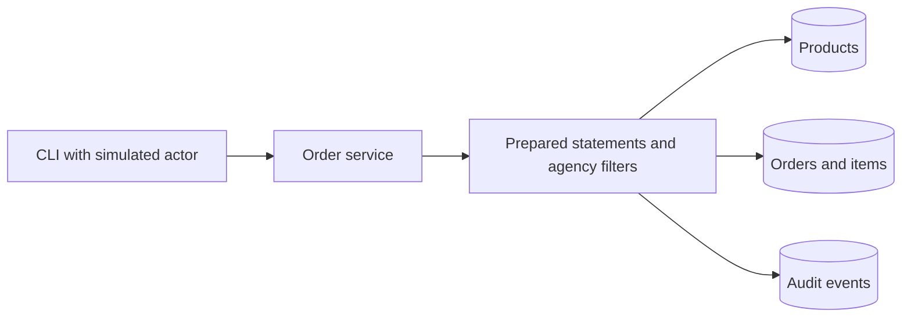

# Secure Agency Orders

**Justin Spratt** | Java 21 | JDBC | MySQL 8.4 | SQL | JUnit

[](https://github.com/justinspratt07/secure-agency-orders/actions/workflows/verify.yml)

A purchasing application that keeps each agency's orders separate, calculates totals from catalog prices, and commits order changes together with their audit records.

Built from my CSS321 Software Assurance coursework as a focused Java and SQL portfolio project. All agencies and sample data are fictional. The local actor is simulated; this project does not implement login or claim production readiness.

## What it demonstrates

- **Relational design:** agencies, products, orders, line items and audit events with keys, constraints and an agency index.
- **SQL reporting:** joins, aggregation and agency filtering for open-order spending by product.
- **Exact totals:** server-side catalog prices, quantities and historical price snapshots using decimal arithmetic.
- **Access controls:** agency-scoped queries and buyer/viewer permissions.
- **Transactional consistency:** order header, items and audit commit together or roll back together.
- **Database tests:** the same behavior suite runs against H2 and MySQL; the documented Docker demo is also exercised in CI.

## Try it with Docker

Requires Docker with Compose and Linux containers. No Java or MySQL installation is needed on your host.

```sh
docker compose up --build --abort-on-container-exit --exit-code-from verify verify
docker compose --profile demo up --build --abort-on-container-exit --exit-code-from demo demo
docker compose --profile demo down
```

The first command runs tests against real MySQL. The second demonstrates the application against a separate MySQL database using a restricted account. The databases are disposable, contain only fictional fixtures and expose no host ports. The configuration uses public test credentials suitable only for this isolated demonstration.

See the [five minute walkthrough](docs/demo.md) for details.

## Try it with Java

Requires JDK 21 and JAVA_HOME configured. The included wrapper downloads Maven 3.9.12.

**Windows PowerShell**

```powershell
.\mvnw.cmd verify exec:java
```

**macOS or Linux**

```sh
./mvnw verify exec:java
```

This quick path uses an in-memory H2 database. Each run starts with fresh sample data. Real MySQL behavior is checked separately.

### Demo highlights

```text
Secure Agency Orders | Justin Spratt
Simulated actor: BUYER-A / AGENCY-A
Other agency order hidden: true
Created total: 110.20 (2 x 25.10 + 3 x 20.00)
Cancelled: true
Injection-shaped ID rejected
Viewer write blocked
```

## Architecture



The application resolves prices from the database and captures them on each order item. Future catalog changes do not rewrite historical commitments. Product rows are locked in a stable order while pricing and writing a basket. A conditional update makes cancellation produce one event even when repeated.

The spending report joins orders, items and products, filters by agency and OPEN status, then groups by product. It measures **open commitments**, not payments or revenue. Denied and nonexistent order lookups both return an empty result.

## Explore the code

| File | What to review |
| --- | --- |
| [OrderService.java](src/main/java/io/github/justinspratt/orders/OrderService.java) | SQL queries, authorization predicates, pricing and transactions |
| [schema.sql](src/main/resources/schema.sql) | Tables, keys, constraints and index |
| [seed.sql](src/main/resources/seed.sql) | Fictional agencies, products and orders |
| [OrderServiceTest.java](src/test/java/io/github/justinspratt/orders/OrderServiceTest.java) | Injection, isolation, rollback, pricing and report tests |
| [compose.yaml](compose.yaml) | Repeatable MySQL tests and demo |
| [Verification workflow](.github/workflows/verify.yml) | H2, MySQL and Compose jobs |

[Design and boundaries](docs/architecture.md) | [Assurance evidence](docs/assurance.md) | [Verification record](docs/verification.md) | [Coursework provenance](docs/coursework.md) | [Design discussion guide](docs/interview-guide.md)

## Bring your own MySQL database

Initialize a fresh MySQL 8.4 database named `agency_orders` with the bundled schema and seed scripts. Provision an application account with the table permissions shown in `docker/demo-account.sql`, using your own password and appropriate host restriction. Do not reuse the disposable demo password.

Set `DB_URL`, `DB_USER`, and `DB_PASSWORD` in the environment. Run:

```sh
./mvnw -Pmysql compile exec:java -Dexec.args=mysql-list
```

`mysql-list` is read-only. `mysql-demo` creates and cancels a demonstration order. Neither initializes or resets an existing database. Use `mvnw.cmd` on Windows. For remote servers configure verified TLS according to the [Connector/J security documentation](https://dev.mysql.com/doc/connector-j/en/connector-j-connp-props-security.html).

To run tests externally, create a dedicated disposable `orders_test` database and set `TEST_DB_URL`, `TEST_DB_USER`, and `TEST_DB_PASSWORD`, then run `./mvnw -Pmysql test`. **Tests drop and recreate their five tables before each case.** The URL guard requires the database name `orders_test`. Use a separate test account with schema permissions; clear those variables to return to H2 tests.

## Scope and next steps

This is a local educational application. It has no web API, real authentication, pagination, production migrations, or operational monitoring. An API must derive actor roles and agency membership from verified server-side identity data. The database account and trusted application code remain part of the trust boundary.

Original coursework documents remain unchanged. Justin Spratt is the sole project author; external libraries retain their own attribution and terms. No open-source license is granted at this stage.
