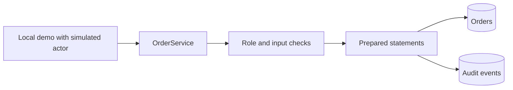
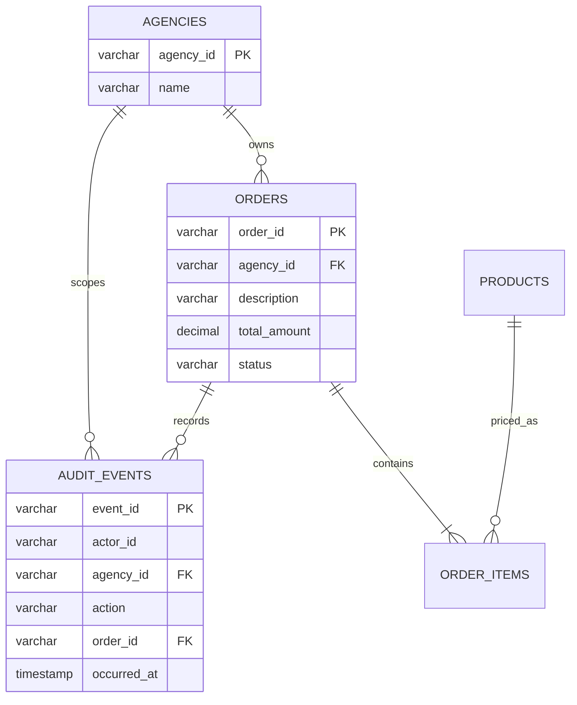

# Architecture

Author: Justin Spratt

The project separates the command-line demonstration from its order service and connection configuration. SQL remains explicit so reviewers can inspect each authorization predicate and transaction boundary.

## Trust boundary

`Actor` is a trusted in-process context, not proof of identity. The demo supplies a fixed actor. Callers with Java execution or direct database access are outside this authorization boundary. A future web layer must authenticate users and resolve agency membership and roles on the server.

An order ID alone never grants access. `find`, `list`, and `cancel` bind the actor's agency in SQL. `create` uses that same agency instead of an independently supplied owner. Unknown and inaccessible order lookups both return an empty result. Globally unique IDs can still reveal collisions through failed creation; public API designs should use server-generated identifiers and generic errors.

## Transaction boundary

Create resolves catalog prices with row locks, then writes the header, line items, and audit in one transaction. Cancel performs the conditional status change and audit insertion in one transaction. Exceptions roll back the transaction. Cancellation uses one conditional update, so repeating it produces no second change or audit event. Audit failure tests exercise real rollback against a database.

## Database choices

H2 provides a fast in-memory demonstration. MySQL uses the same schema and SQL, but requires separate validation. The schema has an agency index, positive monetary amount constraints, quantity bounds, a status constraint, and foreign keys. A line item snapshots its catalog price. The spending query aggregates those snapshots for OPEN orders belonging to the actor. No dynamic sorting or identifier interpolation is used.

Initialization is an explicit fresh-database operation. It is not a versioned migration system and is not safe to repeat against an initialized database. The MySQL read command never initializes a database.

## Limits

Audit rows cover successful mutations; denied attempts and reads are not logged. Events are not cryptographically tamper-evident. There is no HTTP server, session handling, retry framework, connection pool, or production availability claim. Lists are unpaginated and intended for small demo fixtures.
